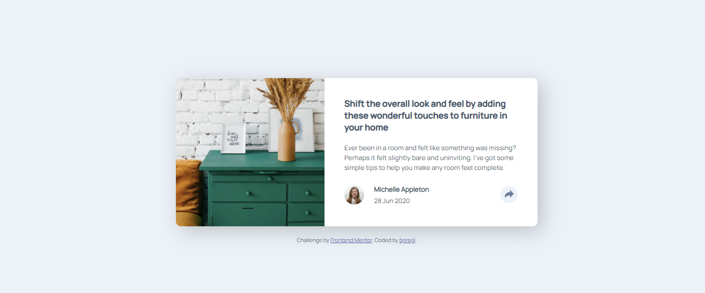

# Frontend Mentor - Article preview component solution

This is a solution to the [Article preview component challenge on Frontend Mentor](https://www.frontendmentor.io/challenges/article-preview-component-dYBN_pYFT). Frontend Mentor challenges help you improve your coding skills by building realistic projects. 

## Table of contents

- [Overview](#overview)
  - [The challenge](#the-challenge)
  - [Screenshot](#screenshot)
  - [Links](#links)
- [My process](#my-process)
  - [Built with](#built-with)
  - [What I learned](#what-i-learned)
  - [Useful resources](#useful-resources)
- [Author](#author)

## Overview

### The challenge

Users should be able to:

- View the optimal layout for the component depending on their device's screen size
- See the social media share links when they click the share icon

### Screenshot

### Links

- Solution URL: [https://github.com/bgregi/article-preview-component](https://github.com/bgregi/article-preview-component)
- Live Site URL: [https://bgregi.github.io/article-preview-component/](https://bgregi.github.io/article-preview-component/)

## My process

### Built with

- HTML
- SASS
- Flexbox
- JavaScript

### What I learned

The challenge served as a great introduction to my Javascript projects, because I was able to remember many concepts I'd seen in my classes but had never really applied before. 

The CSS part was fairly simple, thanks to the minimalistic design, but I still had some troubles at first with the image positioning and sizing. Once I learned about the object-fit property, things started to go well. I also applied for the first time the :after pseudo-property and learned some of what it is capable of.

As I mentioned, Javascript was the most interesting part for me, which is where I learned to change objects classes and colors and make elements appear and disappear on the screen.

Overall, it was a great challenge and I'm excited for the next one.

### Useful resources

- [The Shapes of CSS](https://css-tricks.com/the-shapes-of-css/) - This helped me at creating the "pointy" part of the "share" div for the desktop version.

## Author

- Website - [bgregi's GitHub Profile](https://github.com/bgregi)
- Frontend Mentor - [@bgregi](https://www.frontendmentor.io/profile/bgregi)
